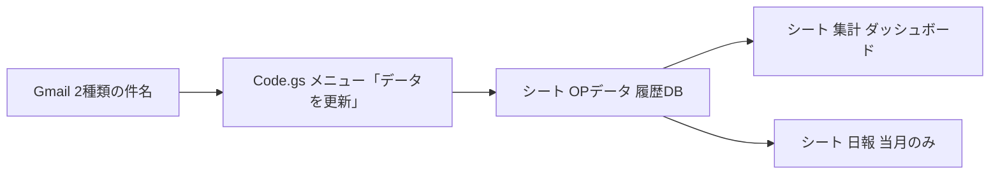

# オプション契約メール集計（GAS）

**運用スプレッドシート:** https://docs.google.com/spreadsheets/d/14hxiLBzvGTuIpfZcoVjiHpz8b419OzUrtQAr5788h3w/edit?gid=1774229739#gid=1774229739  

リンク一覧 → [../マスタ/各種リンク.md](../マスタ/各種リンク.md)

Gmail から **オプションの利用開始・停止** と **入会時のオプション内訳** を読み取り、スプレッドシートで月別に集計するツールです。

---

## 全体像

| レイヤ | 役割 |
|--------|------|
| **GAS** | メール検索・本文解析・`OPデータ` への追記／月の洗い替え |
| **OPデータ** | 1行＝1イベント（受信日時・氏名・区分・オプション名） |
| **集計** | `B1` の対象月で `COUNTIFS` 集計（式で自動計算） |
| **日報** | 当月更新時のみ **C21:C36**（利用開始合計）。D/E/F・月初は手入力／式のまま |

---

## 操作

| メニュー | 実行する関数 | やること |
|----------|--------------|----------|
| **① 全部更新する** | `smartUpdateData` | Gmail → `OPデータ` → **集計** → **日報**（集計B1の月＋日報B1が同じ月なら日報も） |
| **② 日報の数値だけ更新する** | `refreshNippoCurrentMonthFromLog` | 日報 **C列** のみ（`OPデータ` はそのまま） |

時間トリガーは Apps Script で `smartUpdateData` を指定。`installOptionDailyTrigger_` はエディタから実行可。

### 日報と集計の数字の関係

| シート | セル | 中身 |
|--------|------|------|
| **集計** | B列 | 新規入会のみ |
| **集計** | C列 | OP追加のみ |
| **集計** | **D列** | **利用開始合計**（B＋C） |
| **集計** | **E列** | **利用停止** |
| **集計** | **F列** | **翌月の±**（式 `=D−E`） |
| **日報** | **C21:C36** | 当月の利用開始合計（集計の **D列** と同じ数字） |

**ズレていた理由:** 集計は旧来 `COUNTIFS` 式で `OPデータ` A列の日付を見ており、日報の GAS 集計と食い違うことがあった。  
いまは **集計 B/C/D も GAS が `OPデータ` を数える**（日報と同じロジック）。

**月の指定が違うとまだズレます:** 日報 B1＝`2606`（6月）、集計 B1＝`2026年6月` が **別の月** だと数字は一致しません。

図形ボタン「日報作成」には `refreshNippoCurrentMonthFromLog` を割り当て可能。

### 関数の流れ（フル更新時）

`smartUpdateData` → `setupSpreadsheet` → `executeFetchMonth`（または初回 `executeFetchAll`）→ 集計 B〜F → **`updateNippoSheetForMonth`**（日報 C21:C36 のみ）

## 操作（ワンボタン・詳細）

メニュー **「JOYFIT」→「① 全部更新する」** → 内部で `smartUpdateData()`

1. 常に `setupSpreadsheet()` でシート構成・集計式を修復
2. **初回**（`OPデータ` がヘッダーのみ）  
   → 「過去すべて取得しますか？」  
   - **はい** → `executeFetchAll`（全期間 Gmail 検索）  
   - **いいえ** → `executeFetchMonth`（`集計!B1` の月だけ）
3. **2回目以降** → 常に `executeFetchMonth`（選択月だけ再取得）

---

## 対象メール

検索クエリ（`SEARCH_QUERY`）:

- 件名に **【JOYFIT24経堂】オプションご契約につきまして**
- または **【JOYFIT24経堂】ご入会ありがとうございます**

※ 差出人（`from:`）は指定なし。実行アカウントの Gmail にあるメールのみ。

### 解析ロジック

| 件名 | 関数 | 区分（例） | 取れるもの |
|------|------|------------|------------|
| オプションご契約 | `parseOptionContractEmail` | `利用開始(OP追加)` / `利用停止` | 本文の `(利用開始)` `(利用停止)` 行 |
| ご入会ありがとう | `parseSignupEmail` | `利用開始(新規入会)` | 「月会費の内訳」内で **円** があり、かつ `OPTION_LIST` に正規化後マッチした行のみ |

入会メールは **オプション一覧に載っているものだけ** 行になる（0円行やリスト外は除外）。

---

## シート構成

### `OPデータ`（裏方DB）

| 列 | 内容 |
|----|------|
| A | 受信日時 |
| B | 氏名 |
| C | 区分 |
| D | オプション名(メール記載) |
| E | オプション名(集計用) ← `normalizeOptionName` 後 |

### `集計`（表側）

- **B1**: 対象月プルダウン（`2024年1月` 形式・過去2年〜未来1年）
- **3行目〜**: `OPTION_LIST` の16オプション固定行
- **B〜E列**: GAS が 新規入会 / OP追加 / **合計(D)** / 停止 を書き込み
- **F列**: 翌月の± = `D−E`（式）

### `日報`（任意）

- シートが存在し、更新対象が **今月** のときだけ
- `OPTION_LIST` 順に **C21:C36** のみ（利用開始合計）。停止・翌月±は **集計** を参照

---

## 標準オプション（16種）

`OPTION_LIST` と `集計` の行順が一致している必要があります。

安心サポート、安心サポートVIP、水素水、オンラインレッスン、体組成計、契約ロッカー1,500、レンタルマット、プロテイン12杯、プロテイン無制限、プロテイン＋水素水、レンタルタオル、タンニング、セルフエステ、ホットスタジオ、ヨガロッカー、ピラティスリフォーマー

`normalizeOptionName` で表記揺れ（あんしん／ボディプランナー／マットレンタル等）を吸収。

---

## 月次更新の仕組み（部分洗い替え）

`executeFetchMonth`:

1. `OPデータ` から **対象月以外** の行は残す
2. **対象月の行だけ削除**
3. Gmail を `after:YYYY/MM/01 before:翌月/01` で再検索
4. 抽出結果を末尾に追加
5. 当月なら `日報` を更新

---

## 入会メール取込（別ブック）との違い

| | オプション集計（この GAS） | 入会メール取込 |
|--|---------------------------|----------------|
| ブック | `14hxiLBz...` | `1S1Noom6...` |
| 目的 | オプション開始・停止の **件数集計** | 入会者の **メールアドレス一覧** |
| 同じ件名「ご入会…」 | 月会費内訳から **オプション行** を複数生成 | 1通＝1人（名前・メール） |

同じ入会メールでも、読み取る情報が異なります。

---

## 同じ件名で1日に何通も来る場合（Gmailスレッド）

件名が同じだと Gmail は **1スレッドにまとめます**。集計の前提は次のとおりです。

| 原則 | 内容 |
|------|------|
| 数える単位 | **メール1通（message）** ＝ 送信1回。スレッド内の全メッセージをループ |
| 1通にオプション複数 | ご入会の「月会費の内訳」から **オプションごとに1行** |
| 短い通知だけの通 | 内訳がなく `タンニング(6月分)` だけの形式も **別ルートで抽出** |
| 重複防止 | 同一 **メールID＋区分＋オプション名** は1行だけ（F列にメールID） |

再取得時は対象月を洗い替えするため、**集計シート B1 の月で「データを更新」** をやり直すと数字が揃います。

## 注意点

1. **Gmail** … 検索は100件ずつ最大500スレッドまで（極端に多い月は要注意）。
2. **OPTION_LIST 外**（ナショナル会員U・フットレンタル等）は意図的に除外。
3. **`日報` C21:C36** … 日報 B1（例 `2606`）と `OPデータ` の月が一致していること。日報の D/E/F は GAS が上書きしない。
4. **トリガー** … 自動実行は **`smartUpdateData`** 推奨（Gmail取得・集計・日報まで一括）。

---

## 貼り付け

1. 上記スプレッドシート → **拡張機能 → Apps Script**
2. [Code.gs](./Code.gs) を全文貼り付け・保存
3. スプレッドシートを開き直す → **JOYFIT → ① 全部更新する**

初回は「はい」で全件取得を推奨（数分かかる場合あり）。
